# PROJECT_MAP.md - Arquitectura del Proyecto: Las Páginas de Dani

## 1. Topología del Proyecto (Mermaid Graph)

```mermaid
flowchart TD
    subgraph Client ["Frontend Architecture (SPA / Vanilla Modular)"]
        HTML["index.html\n(HTML5 Semántico, SEO, OpenGraph, Schema.org)"]
        
        subgraph Styles ["Módulo de Estilos (CSS Modular)"]
            MAIN_CSS["css/main.css\n(Variables, Base, Utility Classes)"]
            ANIM_CSS["css/animations.css\n(Keyframes, Transiciones, Hover Effects)"]
            COMP_CSS["css/components.css\n(Navbar, Pricing Cards, Portfolio, Modals, Forms)"]
        end

        subgraph Scripts ["Módulo de Lógica JS (Separación de Incumbencias)"]
            APP_JS["js/app.js\n(Inicialización de módulos y ciclo de vida)"]
            NAV_JS["js/navigation.js\n(Smooth Scroll, Sticky Header, Mobile Drawer)"]
            ANIM_JS["js/animations.js\n(ScrollObserver, Entrada/Salida, Lazy Animation)"]
            PRICING_JS["js/pricing.js\n(Selector de planes, FAQ Accordion, Modal Detalle)"]
            WHATSAPP_JS["js/whatsapp-modal.js\n(Validación de formulario Lead Capture -> WhatsApp API)"]
            LAZY_JS["js/lazy-media.js\n(IntersectionObserver para imágenes y embeds diferidos)"]
        end

        subgraph Assets ["Recursos Estáticos"]
            IMG_LOGO["assets/images/logo.svg & logo-white.svg"]
            IMG_PORTFOLIO["assets/images/portfolio-*.svg\n(Nexplay, Gave Propiedades, Impacto Burger)"]
            IMG_HERO["assets/images/hero-illustration.svg"]
            ICONS["assets/icons/*.svg\n(NFC, Speed, Support, WhatsApp, Check, Close)"]
        end

        HTML --> MAIN_CSS & ANIM_CSS & COMP_CSS
        HTML --> APP_JS
        APP_JS --> NAV_JS & ANIM_JS & PRICING_JS & WHATSAPP_JS & LAZY_JS
        HTML --> IMG_LOGO & IMG_PORTFOLIO & IMG_HERO & ICONS
    end

    subgraph External ["Integraciones y Servicios Externos"]
        FONTS["Google Fonts (Plus Jakarta Sans & Outfit)"]
        WHATSAPP_API["WhatsApp Business API Direct Link"]
        SURGE_HOST["Surge.sh Hosting (las-paginas-de-dani.surge.sh)"]
        GITHUB_REPO["GitHub Repo (RedbrickSeven8/las-paginas-de-dani)"]
        GHA_WORKFLOW[".github/workflows/deploy.yml\n(Auto-Deploy en Surge en cada Push)"]
    end

    HTML -.-> FONTS
    WHATSAPP_JS -.-> WHATSAPP_API
    GITHUB_REPO --> GHA_WORKFLOW --> SURGE_HOST
```

## 2. Nodos y Componentes

| Archivo / Carpeta | Responsabilidad |
|---|---|
| `index.html` | Estructura semántica completa (Header, Hero, Beneficios, Servicios/Planes, Portafolio en Vivo, Testimonios, Proceso de 24h, FAQ, Contacto, Modal Lead Capture, Footer). Metaetiquetas SEO, Schema JSON-LD y Open Graph. |
| `css/main.css` | Design tokens (colores `#0A192F`, `#FF7A00`, `#00C853`, tipografías, espaciado, reset CSS y layout responsive). |
| `css/components.css` | Estilos específicos para navbar flotante, tarjetas de precios con badge destacado, grid de portafolio con iframe/preview, modal dinámico, acordeón FAQ y botón flotante de WhatsApp. |
| `css/animations.css` | Definición de keyframes (float, pulse-glow, shimmer, reveal-up, slide-in, bounce, exit-animations) con soporte completo para `prefers-reduced-motion`. |
| `js/navigation.js` | Control del menú móvil accesible (drawer), indicador de scroll activo y scroll suave entre secciones. |
| `js/animations.js` | Motor de animaciones al scroll (IntersectionObserver con `lazy-reveal`), microinteracciones de hover/click y animaciones de entrada y salida de elementos interactivos. |
| `js/pricing.js` | Manejador de selección de planes (Landing Simple, Landing Animada, Web Menú/Catálogo, Web Pedidos WhatsApp) con modal detallado de características. |
| `js/whatsapp-modal.js` | Modal de captura de Lead (Nombre + Teléfono/Empresa) previo a redirección a WhatsApp con mensaje personalizado según el plan seleccionado. |
| `js/lazy-media.js` | Carga diferida (lazy loading nativo + IntersectionObserver fallback) para optimización extrema de rendimiento y Core Web Vitals. |
| `.github/workflows/deploy.yml` | Integración continua con GitHub Actions para despliegue instantáneo en Surge.sh con cada commit a `main`. |

## 3. Flujo de Conversión y Datos

1. **Atracción:** El usuario entra, ve propuesta de valor de entrega en 24h + modelo de suscripción accesible con tarjetas NFC incluidas.
2. **Exploración:** Explora los 4 niveles de servicio, compara características y revisa el portafolio en vivo con proyectos reales (*Nexplay, Gave Propiedades, Impacto Burger*).
3. **Conversión:** Al dar clic en "Solicitar Plan" o en el botón flotante de WhatsApp:
   - Se despliega el modal interactivo de captura.
   - El cliente ingresa su **Nombre**, **Teléfono** y selecciona/confirma su **Plan de Interés**.
   - Se valida el formulario y se redirige instantáneamente al API de WhatsApp con el copy estructurado listo para enviar.
